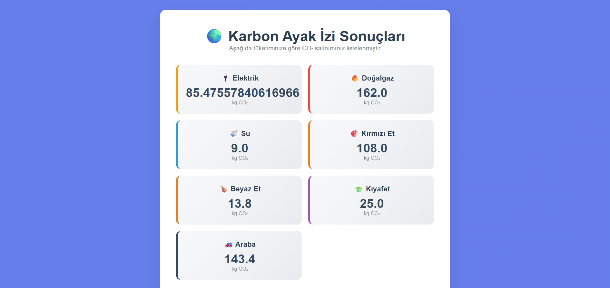

# 🌱 Karbon Ayak İzi Hesaplama Uygulaması

Bu proje, bireylerin günlük yaşamlarındaki alışkanlıklarına göre karbon ayak izlerini tahmin etmelerine olanak tanıyan interaktif bir web uygulamasıdır.  
**Geliştirici:** Rüzgar

---

## 🧭 Proje Tanımı

Karbon ayak izi, bireylerin atmosfere saldığı sera gazı miktarını ifade eder. Bu proje, kullanıcıların ulaşım, enerji tüketimi, gıda alışkanlıkları ve genel yaşam tarzı gibi faktörlere göre yıllık karbon ayak izlerini hesaplamalarını sağlar.  

Projenin temel amacı; kullanıcıların çevresel etkilerini daha iyi anlamalarını sağlamak, farkındalık oluşturmak ve sürdürülebilir yaşam biçimlerine geçişte yol gösterici olmaktır.

---

## ⚙️ İşlevler ve Özellikler

- ✅ **Form Tabanlı Girdi Alımı**  
  Kullanıcıdan ulaşım şekli, yediği yemek türleri, elektrik kullanımı gibi bilgiler alınır.

- ✅ **Gerçek Zamanlı Hesaplama**  
  Kullanıcının girdiği verilere göre anlık karbon salınım miktarı hesaplanır.

- ✅ **Etkileşimli Arayüz**  
  Modern ve kullanıcı dostu arayüz ile herkesin kolayca kullanabileceği bir sistem sunulur.

- ✅ **Özelleştirilmiş Sonuçlar ve Tavsiyeler**  
  Hesaplama sonucunda kullanıcıya özel karbon salınım değeri ve öneriler sunulur.

- ✅ **Responsive Tasarım**  
  Mobil, tablet ve masaüstü cihazlara uyumlu yapı.

---

## 🖼️ Projenin Nasıl Çalıştığını Gösterme

Aşağıda projeye ait bir örnek ekran görüntüsü yer almakta:  

                                    (./assets/resim2.png)


---

## 📦 Kurulum ve Kullanım

Projeyi yerel bilgisayarınızda çalıştırmak için aşağıdaki adımları izleyin:

1. Bu repoyu klonlayın:
   ```bash
   git clone https://github.com/kullaniciadi/karbon-ayak-izi.git

---

💬 Geri Bildirim ve Katkı
Geliştirme süreci tamamen açık kaynak felsefesiyle yürütülmektedir.
Her türlü geri bildirimi, hata raporlarını veya geliştirme fikirlerini şu yollarla paylaşabilirsiniz:

GitHub Issues sekmesinden sorun bildirin

Pull request gönderin

---

🏁 Sonuç
Bu proje, çevre dostu yaşam için farkındalık yaratmayı ve bireylerin kendi karbon ayak izlerini analiz edebilmesini hedefler. Eğitim amaçlı kullanılabileceği gibi çevre bilimleri derslerinde, sivil toplum kuruluşlarının kampanyalarında veya kişisel farkındalık aracı olarak da değerlendirilebilir.

